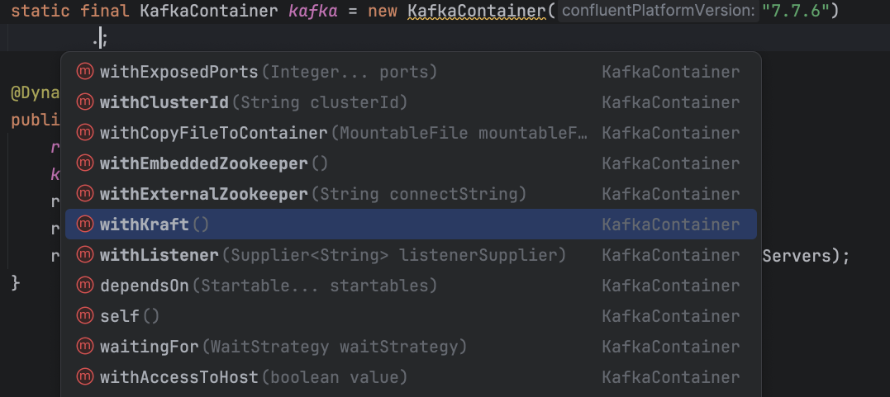

# Step 7: Test the API

Checking the health endpoint ensured all of the services are up and running. Now that that's passing, you're ready to validate the API's actual business logic.

1. Create a `RatingsControllerTest` with the following code:

    ```java save-as=src/test/java/com/example/demo/RatingsControllerTest.java
    package com.example.demo;

    import com.example.demo.model.Rating;
    import org.junit.jupiter.api.Test;

    import static io.restassured.RestAssured.given;
    import static org.awaitility.Awaitility.await;
    import static org.hamcrest.Matchers.is;

    public class RatingsControllerTest extends AbstractIntegrationTest {

        @Test
        public void testRatings() {
            String talkId = "testcontainers-integration-testing";

            given(requestSpecification)
                    .body(new Rating(talkId, 5))
                    .when()
                    .post("/ratings")
                    .then()
                    .statusCode(202);

            await().untilAsserted(() -> {
                given(requestSpecification)
                        .queryParam("talkId", talkId)
                        .when()
                        .get("/ratings")
                        .then()
                        .body("5", is(1));
            });

            for (int i = 1; i <= 5; i++) {
                given(requestSpecification)
                        .body(new Rating(talkId, i))
                        .when()
                        .post("/ratings");
            }

            await().untilAsserted(() -> {
                given(requestSpecification)
                        .queryParam("talkId", talkId)
                        .when()
                        .get("/ratings")
                        .then()
                        .body("1", is(1))
                        .body("2", is(1))
                        .body("3", is(1))
                        .body("4", is(1))
                        .body("5", is(2));
            });
        }

        @Test
        public void testUnknownTalk() {
            String talkId = "cdi-the-great-parts";

            given(requestSpecification)
                    .body(new Rating(talkId, 5))
                    .when()
                    .post("/ratings")
                    .then()
                    .statusCode(404);
        }
    }
    ```

2. Run all the tests:

    ```bash
    ./mvnw clean test
    ```

    Test failed. Why? There is no Kafka! Oops!

## Adding Kafka

Running Kafka in Docker is easy with Testcontainers, thanks to the [Testcontainers Kafka module](https://java.testcontainers.org/modules/kafka/). It provides integration with Kafka and the `KafkaContainer` abstraction for your code.

To start Kafka, you define it very similar to the Redis service and set the `spring.kafka.bootstrap-servers` system property.

1. In the `AbstractIntegrationTest` add the following variable to define the Kafka container:

    ```java
    static final KafkaContainer kafka = new KafkaContainer(DockerImageName.parse("confluentinc/cp-kafka:7.7.8"));
    ```

2. Add the import for the `DockerImageName` class:

   ```java
   import org.testcontainers.utility.DockerImageName;
   ```

3. Rename the `configureRedis` method to `configureRedisAndKafka` and add the following line to the method body:

    ```java
    kafka.start();
    registry.add("spring.kafka.bootstrap-servers", kafka::getBootstrapServers);
    ```

    At this point, the entire file should look like the following:

    ```java save-as=src/test/java/com/example/demo/AbstractIntegrationTest.java
    package com.example.demo;

    import io.restassured.RestAssured;
    import io.restassured.builder.RequestSpecBuilder;
    import io.restassured.specification.RequestSpecification;
    import org.junit.jupiter.api.BeforeEach;
    import org.springframework.boot.test.context.SpringBootTest;
    import org.springframework.boot.test.web.server.LocalServerPort;
    import org.springframework.http.MediaType;
    import org.springframework.test.context.DynamicPropertyRegistry;
    import org.springframework.test.context.DynamicPropertySource;
    import org.testcontainers.containers.GenericContainer;
    import org.testcontainers.containers.KafkaContainer;
    import org.testcontainers.shaded.com.google.common.net.HttpHeaders;
    import org.testcontainers.utility.DockerImageName;

    @SpringBootTest(webEnvironment = SpringBootTest.WebEnvironment.RANDOM_PORT, properties = {
            "spring.datasource.url=jdbc:tc:postgresql:18-alpine://testcontainers/workshop"
    })
    public class AbstractIntegrationTest {
        protected RequestSpecification requestSpecification;

        @LocalServerPort
        protected int localServerPort;

        @BeforeEach
        void setUpAbstractIntegrationTest() {
            RestAssured.enableLoggingOfRequestAndResponseIfValidationFails();
            requestSpecification = new RequestSpecBuilder()
                    .setPort(localServerPort)
                    .addHeader(
                            HttpHeaders.CONTENT_TYPE,
                            MediaType.APPLICATION_JSON_VALUE
                    )
                    .build();
        }

        static final GenericContainer redis = new GenericContainer("redis:8.6-alpine")
                .withExposedPorts(6379);
        static final KafkaContainer kafka = new KafkaContainer(DockerImageName.parse("confluentinc/cp-kafka:7.7.8"));

        @DynamicPropertySource
        public static void configureRedisAndKafka(DynamicPropertyRegistry registry) {
            redis.start();
            kafka.start();
            registry.add("spring.data.redis.host", redis::getHost);
            registry.add("spring.data.redis.port", redis::getFirstMappedPort);
            registry.add("spring.kafka.bootstrap-servers", kafka::getBootstrapServers);
        }
    }
    ```

4. Run the tests again:

    ```bash
    ./mvnw clean test
    ```

    Everything should work now!

## Additional optimizations

### Hint one - easy configuration setup

Some of the modules expose helper methods for common use cases. For example, the `KafkaContainer` provides a `withKraft` method to configure the container to run in Kraft mode.




### Hint two - starting containers in parallel

To speed up container launch (especially when images may need to be pulled), you can start them in parallel using Streams:

```java
Stream.of(redis, kafka).parallel().forEach(GenericContainer::start);
```
